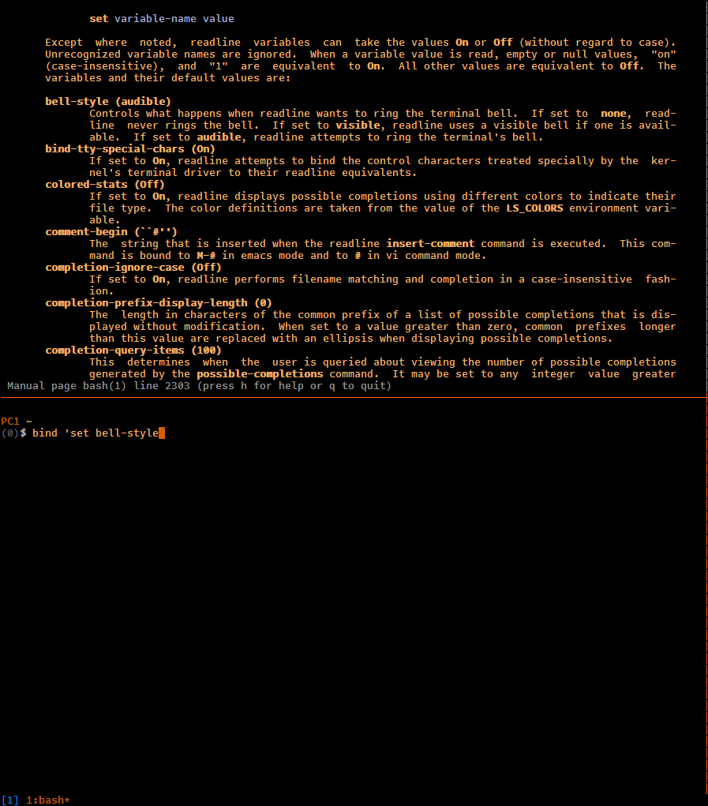

# Tmux asos

Bash-complete current word with blank-delimited strings from all visible panes.

In the screenshot above, the word `bell-style` has been completed thanks to the
occurrence from the man page in the top pane.

## Key bindings

- `prefix + C-a` : insert completion (longest matching part if more than one)

## Installation with [Tmux Plugin Manager](https://github.com/tmux-plugins/tpm) (recommended)

Add plugin to the list of TPM plugins in `.tmux.conf`:

    set -g @plugin 'fcpg/tmux-asos'

Hit `prefix + I` to fetch the plugin and source it. You should now be able to
use the plugin.

## Manual Installation

Clone the repo:

    $ git clone https://github.com/fcpg/tmux-asos ~/clone/path

Add this line to the bottom of `.tmux.conf`:

    run-shell ~/clone/path/asos.tmux

Reload TMUX environment:

    # type this in terminal
    $ tmux source-file ~/.tmux.conf

You should now be able to use the plugin.

## Configuration

Change the default key eg. 'x':

- Put `set -g @asos-key 'x'` in `.tmux.conf`.

Trigger completion without the tmux prefix key:

- Put `set -g @asos-key-noprefix 1` in `.tmux.conf`.

Change the temporary directory:

- Define "$ASOS_TMPDIR" in `.bash_profile` or `.bashrc` 

Set the minimum length (default: 8) for a word to be included in completion 
list eg. 4:

- Put `set -g @asos-minlen 4` in `.tmux.conf`.

## Todo

- Support for other shells (pull requests are welcome)
- Show list when more than one match?
 
## License

[Attribution-ShareAlike 4.0 Int.](https://creativecommons.org/licenses/by-sa/4.0/)

